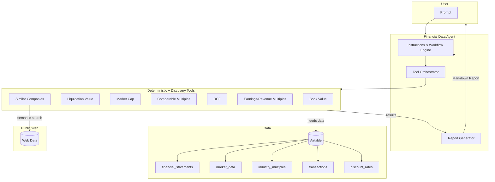
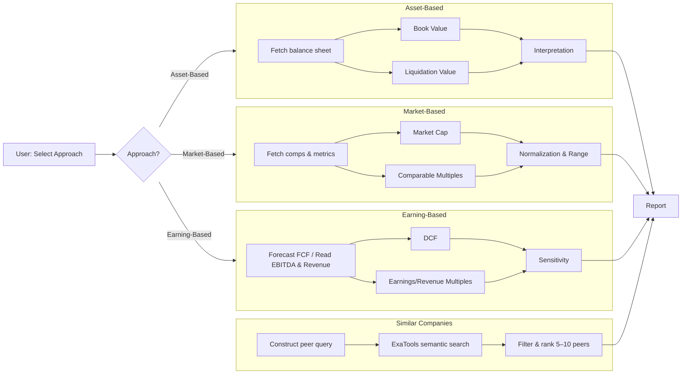

## Company Valuation Agent

Modern, tool-augmented AI agent that performs corporate valuation using Asset-Based, Market-Based, and Earning-Based approaches. It integrates with Airtable for data, calculates results using deterministic tools, performs peer discovery via semantic search, and generates a structured, analyst-grade Markdown report.

### Highlights
- Tool-augmented AI with deterministic financial calculators
- Airtable-backed data retrieval for companies and statements
- Clear, auditable formulas with confidence scoring
- Triangulated valuation across three approaches
- Semantic peer discovery (similar companies) via ExaTools

---

### Architecture Overview



---

### Files & Entry Points
- `Modules/CompanyValuation/CompanyValuation.py`: Agent definition, instructions, and prompts
- `Modules/CompanyValuation/Tools/CompanyValuationDB.py`: Airtable connectors (companies, financials, multiples, etc.)
- `Modules/CompanyValuation/Tools/Calculations.py`: All valuation tools (6 total)
- `run_company_valuation.py`: Simple runner that invokes the agent

---

### Data Sources (Airtable)
The agent expects the following Airtable tables. Set credentials via environment variables.

- `companies`
- `financial_statements`
- `market_data`
- `transactions`
- `discount_rates`
- `industry_multiples`

Environment variables:
- `AIRTABLE_API_KEY`
- `AIRTABLE_BASE_ID`
- `XAI_API_KEY` (for the agent LLM model)
- `EXA_API_KEY` (for ExaTools semantic peer discovery)

---

### Tools Catalog (Deterministic)
Located in `Tools/Calculations.py`.

1) Asset-Based
- Book Value: `calculate_book_value(company?, period?, records?, total_assets?, total_liabilities?)`
  - Formula: Book Value = Total Assets − Total Liabilities
- Liquidation Value: `estimate_liquidation_value(company?, period?, records?, asset_breakdown?, total_liabilities?, discounts?)`
  - Formula: Σ(Asset Value × Liquidation Discount) − Total Liabilities

2) Market-Based
- Market Cap: `calculate_market_cap(company?, period?, records?, share_price?, shares_outstanding?)`
  - Formula: Market Cap = Share Price × Shares Outstanding
- Comparable Multiples: `calculate_comparable_multiples(company?, period?, records?, revenue?, ebitda?, net_income?, ev_ebitda_multiple?, pe_multiple?, ev_sales_multiple?, industry_multiples?)`
  - Formula: Company Value = Comparable Metric × Industry Multiple

3) Earning-Based
- DCF: `calculate_dcf(company?, period?, records?, free_cash_flows?, wacc?, terminal_growth_rate?, forecast_years=5)`
  - Formula: Σ(FCF_t/(1+WACC)^t) + TV/(1+WACC)^n, with TV = FCF_n×(1+g)/(WACC−g)
- Earnings/Revenue Multiples: `calculate_earnings_multiple(company?, period?, records?, ebitda?, revenue?, ebitda_multiple?, revenue_multiple?, industry_multiples?)`
  - Formula: Value = EBITDA × Multiple and/or Revenue × Multiple

All tools return structured dicts with: `success`, `inputs`, `result`, `confidence`, and `notes`.

4) Peer Discovery (Similarity Search)
- Similar Companies: uses `ExaTools` to perform semantic search for 5–10 peers based on the analyzed company’s profile (sector, business model, products). Returns names, short rationales, and source links.

---

### Workflow Logic (Inside the Agent)

The agent follows the selected approach and orchestrates the needed tools. It then generates a structured Markdown report with formulas, inputs, scenarios, and a triangulated valuation.



---

### Running the Agent

1) Install dependencies and set environment variables in a `.env` file:
```
AIRTABLE_API_KEY=...
AIRTABLE_BASE_ID=...
XAI_API_KEY=...
```

2) From the `Backend` directory, run:
```bash
python run_company_valuation.py
```

3) To try prepared prompts, open `Modules/CompanyValuation/CompanyValuation.py` and uncomment prompts at the bottom (Asset-Based, Market-Based, Earning-Based, scenarios, and comprehensive analyses).

---

### Example Prompts
- “Perform an Asset-Based valuation for AlphaSoft Ltd using the Book Value and Liquidation tools. Include assumptions and confidence.”
- “Run a Market-Based valuation using EV/EBITDA, P/E, and EV/Sales for GreenFoods Inc. Compare against sector averages.”
- “Compute a 5-year DCF for AlphaSoft Ltd with WACC=10% and terminal growth=3%. Provide sensitivity to ±2% WACC and ±1% growth.”
- “Triangulate valuation across all three methods and provide a final range and rationale.”
- “After the valuation, list 5–10 similar companies with 1-line reasons and links.”

---

### Adding New Data Fields
- Extend Airtable tables with new fields (e.g., segment revenue, region)
- Map new fields in `CompanyValuationDB.py`
- Update tool extraction logic in `Calculations.py` using `_get_number` and `_extract_fields`

---

### Design Choices
- Deterministic calculators for auditability and repeatability
- Heuristic confidence scores based on data completeness and method robustness
- Graceful fallbacks if some fields are missing (e.g., blanket liquidation discount)
- Peer discovery uses semantic search to complement financial comps when structured comps are scarce

---

### Troubleshooting
- “No financial statement records available”: Ensure Airtable API key/base ID are set and tables exist
- DCF errors: Verify `WACC > terminal growth` and non-empty FCF inputs
- Multiples missing: Ensure `industry_multiples` has EV/EBITDA, P/E, and EV/Sales or pass them explicitly
- No peers returned: Ensure `EXA_API_KEY` is set and the company prompt includes sector and business description

---

### Roadmap
- Add sector-aware discount/multiple presets
- Expand scenario engine with Monte Carlo and bear/base/bull distributions
- Support private-market transaction comps


