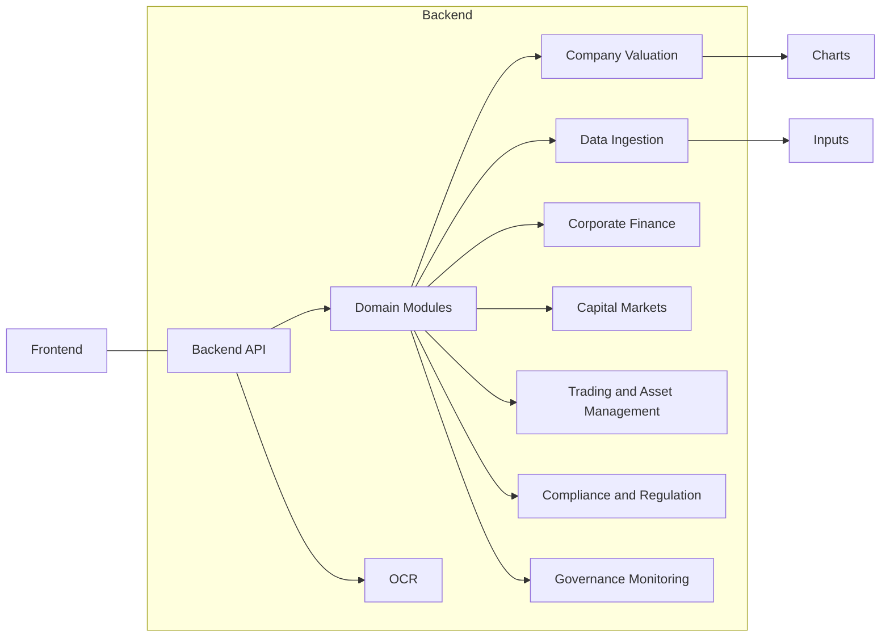

## Banking & Investment OS

Modern, modular platform for banking, capital markets, client advisory, governance, and compliance. Monorepo includes a Python backend for analytics/OCR and a TypeScript frontend for a polished UI.

### Demo
- Watch the walkthrough: [Project demo (Canva)](https://www.canva.com/design/DAG1HGuwmr4/A05HBRJZdkt7Ys4ZYyszCw/edit?utm_content=DAG1HGuwmr4&utm_campaign=designshare&utm_medium=link2&utm_source=sharebutton)

### Highlights
- Modular finance modules: M&A, Capital Markets, Trading & Asset Management, Compliance, Client Advisory, Governance
- OCR ingestion pipeline with fallback strategies
- Interactive UI built with React, Vite, Tailwind, and a modern component system
- Extensible valuation engine and analytics utilities

### Repository Layout
```
Banking-Investment-OS/
  Backend/
    Modules/
      CompanyValuation/
      Data_Ingestion_Module.py
      Trading_Asset_Management_Module.py
      ...
    server.py
    server_example.py
    setup_ocr_client.py
    install_fallback_ocr.py
  Frontend/
    src/
      pages/
      components/
      lib/
    package.json
    vite.config.ts
```

### System Architecture


### Quick Start

Prerequisites:
- Node.js 18+ (recommended 20+), npm
- Python 3.10+ and pip
- Git

Backend:
```bash
cd Backend
python -m venv .venv
# Activate the virtual environment
# - PowerShell:   .\.venv\Scripts\Activate.ps1
# - CMD:          .\.venv\Scripts\activate.bat
# - Git Bash:     source .venv/Scripts/activate
# - macOS/Linux:  source .venv/bin/activate
python -m pip install --upgrade pip
# If a requirements file exists, install it; otherwise, install on demand as modules require
# pip install -r requirements.txt
python server.py
```

Frontend:
```bash
cd Frontend
npm install
npm run dev
```

Open the app: http://localhost:5173 (default Vite dev server)


### Notable Backend Entry Points
- `Backend/server.py`: Main server with endpoints integrating modules and OCR
- `Backend/setup_ocr_client.py` and `Backend/install_fallback_ocr.py`: OCR configuration and fallback installation
- `Backend/Modules/CompanyValuation/CompanyValuation*.py`: Valuation engines and tools

### Notable Frontend Entry Points
- `Frontend/src/main.tsx`, `Frontend/src/App.tsx`: Application bootstrap
- `Frontend/src/pages/*`: Top-level pages (e.g., `AgentChat`, `Landing`, `SubTeam`)
- `Frontend/src/components/ui/*`: Reusable UI primitives

### Development Tips
- Keep modules decoupled with clean function interfaces
- Prefer typed boundaries in the frontend; reuse UI primitives from `components/ui`
- Store generated charts in `Backend/charts` or a configured media path
- Use the `Inputs` folder for PDFs/CSVs during local runs

### License
MIT (or your organization’s standard). Update as appropriate.


